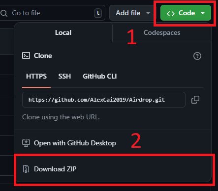
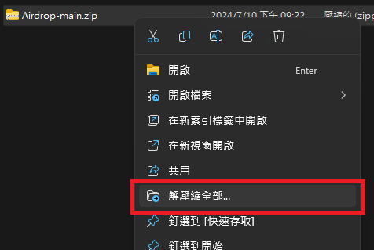
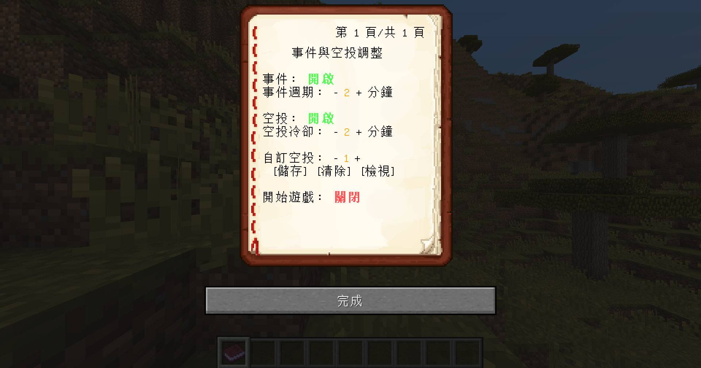

# 空投資料包

空投資料包是由啊U發起、現由AC製作和維護的生存/PVP向專案。本資料包常與UHC Evolve搭配，作為UHC的擴充包。

## 目錄

1. <a href="#installation">安裝</a>
2. <a href="#book">書本</a>
3. <a href="#introduction">內容</a>
4. <a href="#links">連結</a>

## 安裝

要安裝本資料包，可遵循以下步驟：

1. 下載 
	點擊 [GitHub](https://github.com/AlexCai2019/Airdrop) 的 "<> Code ▼" 按鈕，選擇 "Download ZIP"。 
	
2. 解壓縮 
	將下載下來的.zip檔解壓縮，右鍵選擇「解壓縮全部」： 
	 
	也可以使用WinRAR的「解壓縮至此」： 
	
3. 安裝資料包 
	參考此教學：[教學:安裝資料包](https://zh.minecraft.wiki/w/Tutorial:%E5%AE%89%E8%A3%85%E6%95%B0%E6%8D%AE%E5%8C%85) 
	重新進入遊戲，或是輸入 `/reload` 指令。 
	 
4. 完成安裝 
	輸入 `/function airdrop:install` 指令安裝空投系統： 
	
5. 解除安裝 
	如果要解除安裝，請輸入 `/function airdrop:uninstall` 
	

<a href="#contents">回目錄</a>

## 書本

輸入指令 `/function airdrop:book` 就可以獲得設定書本： 
 
- 事件 
	若設定為開啟，則當遊戲經過一段時間後，會有隨機事件發生。
- 事件週期 
	隨機事件發生的週期。
- 空投 
	若設定為開啟，則當遊戲經過一段時間後，玩家會拿到空投道具，<u title="預設右鍵">使用</u>就可以召喚空投。
- 空投冷卻 
	重新獲得空投道具的冷卻時間。
- 自訂空投 
	可以在空投裡使用自訂的空投，有1~4的編號。
- 儲存自訂空投 
	站在容器(箱子、界伏盒等)上點擊，儲存目前編號的自訂空投。
- 清除自訂空投 
	清除目前編號的自訂空投。
- 查看自訂空投 
	查看目前編號的自訂空投。
- 開始遊戲 
	啟用或停用整個事件和空投系統。

<a href="#contents">回目錄</a>

## 內容

本資料包分為兩大內容：空投與事件。 
每過一段時間，全體玩家會拿到一個空投道具(終界之眼)，<u title="預設右鍵">使用</u>這個空投道具就可以召喚空投。空投最常出現的是物資箱，內含各種包括但不限於木頭、石頭、食物、武器、防具等物資。 
除了物資箱外，另有神秘商人、流髑(搭配UHC Evolve資料包會變成友軍)、雷電、爆裂等特殊空投召喚物。 
透過開箱或與商人交易，可以獲得許多特殊物品，包括丟出去會產生蜘蛛網的雪球、放置就會挖洞的鑽地機等。 
善用空投道具吧！

<a href="#contents">回目錄</a>

## 連結

- [巴哈姆特](https://forum.gamer.com.tw/C.php?bsn=18673&snA=200820)
- [GitHub](https://github.com/AlexCai2019/Airdrop)
- [MediaFire](https://www.mediafire.com/file/07vzo8a2t57luey)

<a href="#contents">回目錄</a>