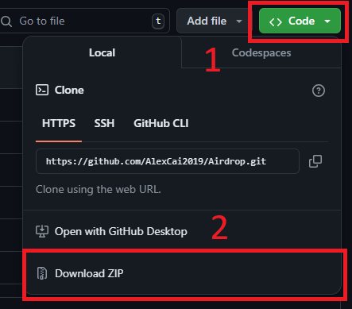
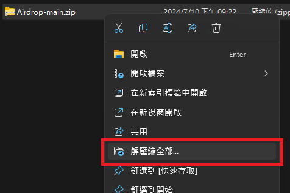
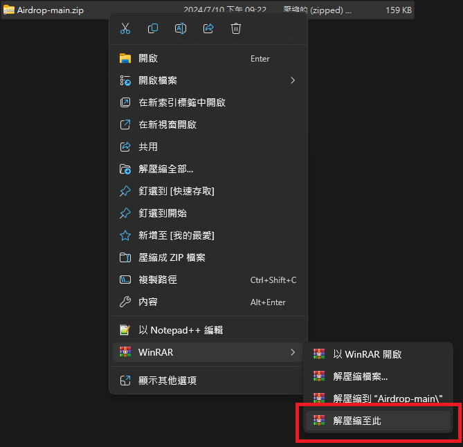
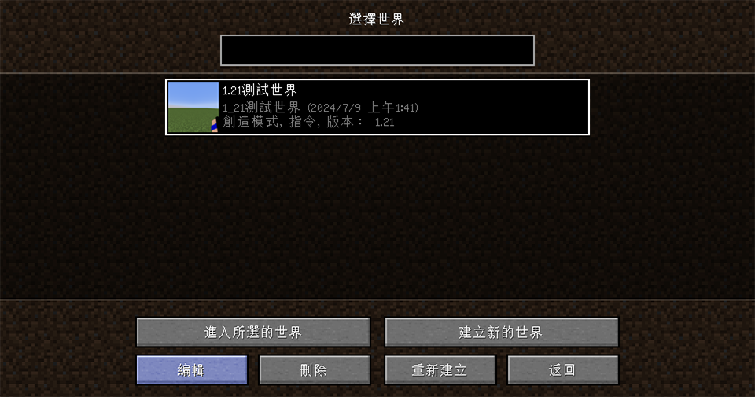
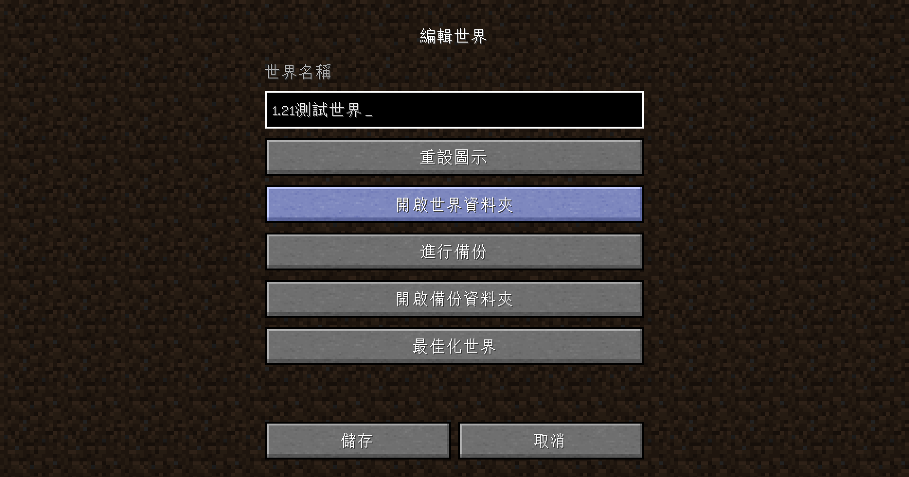
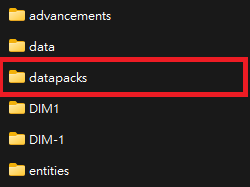
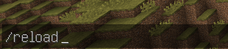
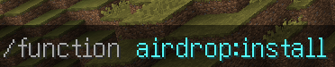

# 空投資料包

空投資料包是由啊U發起、現由AC製作和維護的生存/PVP向專案。本資料包常與UHC Evolve搭配，作為UHC的擴充包。

## 目錄

1. <a href="#installation">安裝</a>
2. <a href="#introduction">內容</a>

## 安裝

要安裝本資料包，可遵循以下步驟：

1. 下載 
	點擊 [GitHub](https://github.com/AlexCai2019/Airdrop) 的 "<> Code ▼" 按鈕，選擇 "Download ZIP"。 
	
2. 解壓縮 
	將下載下來的.zip檔解壓縮，右鍵選擇「解壓縮全部」： 
	 
	也可以使用WinRAR的「解壓縮至此」： 
	
3. 找到地圖檔 
	找到地圖檔的放置位置： 
	 
	 
4. 安裝資料包 
	將已解壓縮的資料包放入 `datapacks` 資料夾： 
	 
	重新進入遊戲，或是輸入 `/reload` 指令。 
	 
5. 完成安裝 
	輸入 `/function airdrop:install` 指令安裝空投系統： 
	

## 內容

本資料包分為兩大內容：空投與事件。 
每過一段時間，全體玩家會拿到一個空投道具(終界之眼)，<u title="預設右鍵">使用</u>這個空投道具就可以召喚空投。空投最常出現的是物資箱，內含各種包括但不限於木頭、石頭、食物、武器、防具等物資。 
除了物資箱外，另有神秘商人、流髑(搭配UHC Evolve資料包會變成友軍)、雷電、爆裂等特殊空投召喚物。 
透過開箱或與商人交易，可以獲得許多特殊物品，包括丟出去會產生蜘蛛網的雪球、放置就會挖洞的鑽地機等。 