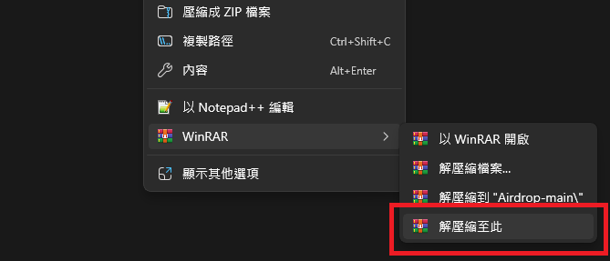
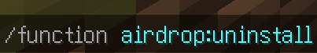
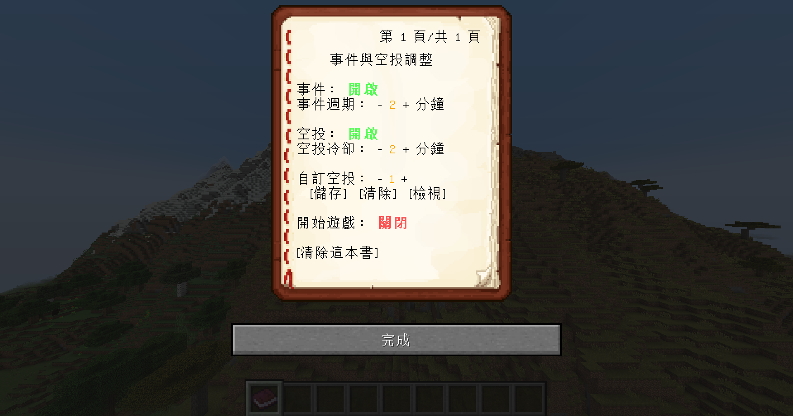

# 空投資料包

空投資料包是由啊U發起、現由AC製作和維護的生存/PVP向專案。本資料包常與UHC Evolve搭配，作為UHC的擴充包。

## 目錄

[TOC]

## 安裝

要安裝本資料包，可遵循以下步驟：

1. 下載 
	點擊 [GitHub](https://github.com/AlexCai2019/Airdrop) 的 "<> Code ▼" 按鈕，選擇 "Download ZIP"。 
	 
	或是點擊 [MediaFire](https://www.mediafire.com/file/07vzo8a2t57luey) 的 "DOWNLOAD" 按鈕。 
	
2. 解壓縮 
	**如果使用的是MediaFire，則可以跳過這部分。** 
	將下載下來的.zip檔解壓縮，右鍵選擇「解壓縮全部」： 
	 
	也可以使用WinRAR的「解壓縮至此」： 
	 
	**如果使用的是MediaFire，則不需要解壓縮。**
3. 安裝資料包 
	參考此教學：[教學:安裝資料包](https://zh.minecraft.wiki/w/Tutorial:%E5%AE%89%E8%A3%85%E6%95%B0%E6%8D%AE%E5%8C%85) 
	重新進入遊戲，或是輸入 `/reload` 指令。 
	 
4. 完成安裝 
	輸入 `/function airdrop:install` 指令安裝空投系統： 
	
5. 解除安裝 
	如果要解除安裝，請輸入 `/function airdrop:uninstall` 
	

<a href="#contents">回目錄</a>

## 書本

輸入指令 `/function airdrop:book` 就可以獲得設定書本(需要OP)： 
 
- 事件 
	若設定為開啟，則當遊戲經過一段時間後，會有隨機事件發生。
- 事件週期 
	隨機事件發生的週期。
- 空投 
	若設定為開啟，則當遊戲經過一段時間後，玩家會拿到空投道具，<u title="預設右鍵">使用</u>就可以召喚空投。
- 空投冷卻 
	重新獲得空投道具的冷卻時間。
- 自訂空投 
	可以在空投裡使用自訂的空投，有1~4的編號。
	- 儲存 
		站在容器(箱子、界伏盒等)上點擊，儲存目前編號的自訂空投。
	- 清除 
		清除目前編號的自訂空投。
	- 檢視 
		檢視目前編號的自訂空投。
- 開始遊戲 
	啟用或停用整個事件和空投系統。
- 清除這本書 
	點擊可以清除這本書。

自訂空投使用展示： 

<a href="#contents">回目錄</a>

## 內容

本資料包分為兩大內容：空投與事件。 
每過一段時間，全體玩家會拿到一個空投道具(海洋之心)，<u title="預設右鍵">使用</u>這個空投道具就可以召喚空投。 
空投最常出現的是物資箱，內含各種包括但不限於木頭、石頭、食物、武器、防具等物資。 
除了物資箱外，另有神秘商人、流髑(搭配UHC Evolve資料包會變成友軍)、雷電、爆裂等特殊空投召喚物。 
透過開箱或與商人交易，可以獲得許多特殊物品，包括丟出去會產生蜘蛛網的雪球、放置就會挖洞的鑽地機等。 
善用空投道具吧！

### 特殊方塊

在空投中，有機會召喚到特殊的方塊，踩在上面或是使用魔杖會有不同的效果，這些效果搭配UHC Evolve資料包體驗最好：

- 西瓜
	- 踩在上面：回血
	- 魔杖：5格內我方玩家生命值提升I60秒
- 冰磚
	- 踩在上面：加速
	- 魔杖：召喚出一面雪塊牆
- 終界石
	- 踩在上面：失重(跳躍提升 + 緩降)
	- 魔杖：發射缺氧攻擊
- 洋紅色釉陶
	- 採在上面：可以打死空投雞，該次空投作廢
	- 魔杖：對自己和身邊5格內最近的敵隊玩家造成超大的爆炸傷害

魔杖的使用方式有兩種，一種是站在特殊方塊上<u title="預設右鍵">使用</u>魔杖，另一種是<u title="預設右手">慣用手</u>拿著魔杖，<u title="預設左手">非慣用手</u>拿著特殊方塊並<u title="預設右鍵">使用</u>。兩種方式都需要<u title="預設右手">慣用手</u>拿著魔杖。

<a href="#contents">回目錄</a>

## 舊版

透過 [GitHub](https://github.com/AlexCai2019/Airdrop) 可下載舊版的空投： 
1. 選擇 
	點擊 "main ▼"按鈕，選擇版本。 
	
2. 下載 
	進行 <a href="#installation">安裝</a> 章節內的步驟。

<a href="#contents">回目錄</a>

## 連結

- [巴哈姆特](https://forum.gamer.com.tw/C.php?bsn=18673&snA=200820)
- [GitHub](https://github.com/AlexCai2019/Airdrop)
- [MediaFire](https://www.mediafire.com/file/07vzo8a2t57luey)

<a href="#contents">回目錄</a>